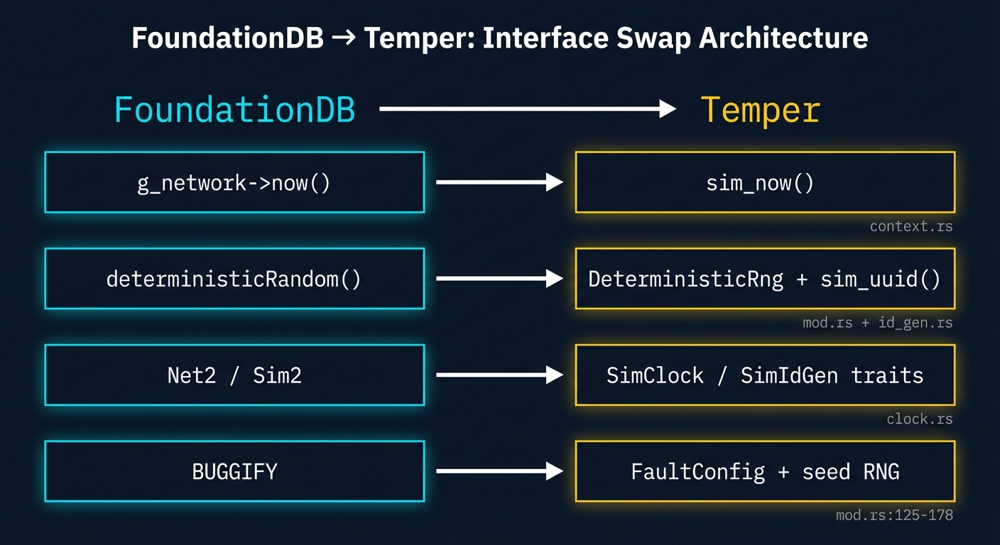
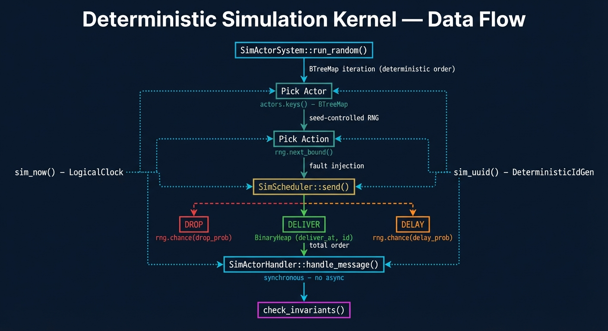
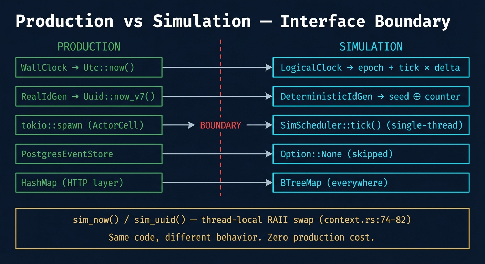

# FoundationDB DST Compliance Assessment

Temper's deterministic simulation testing (DST) architecture is modeled after FoundationDB's simulation framework — the system that famously let a small team build a distributed database with "industrial-grade" reliability. This document maps each FoundationDB DST principle to its concrete implementation in Temper, with code references and verification status.

**Review date**: 2026-02-12
**Verdict**: PASS (0 blocking findings)
**Crates reviewed**: temper-runtime, temper-jit, temper-server

---

## Interface Swap Architecture



FoundationDB established four core DST invariants. Temper implements all four through Rust trait-based interface swapping.

| FoundationDB Principle | Temper Implementation | File |
|---|---|---|
| `g_network->now()` | `sim_now()` | `temper-runtime/src/scheduler/context.rs` |
| `deterministicRandom()` | `DeterministicRng` + `sim_uuid()` | `temper-runtime/src/scheduler/mod.rs` + `id_gen.rs` |
| `Net2` / `Sim2` swap | `SimClock` / `SimIdGen` traits | `temper-runtime/src/scheduler/clock.rs` |
| `BUGGIFY` | `FaultConfig` + seed-controlled RNG | `temper-runtime/src/scheduler/mod.rs:125-178` |
| Single-threaded cooperative multitasking | `SimScheduler` + `SimActorSystem` | `temper-runtime/src/scheduler/mod.rs` + `sim_actor_system.rs` |

---

## Principle 1: Controlled Time

**FoundationDB**: All code must call `g_network->now()` for time. Never `gettimeofday()`. The simulation controls what "now" means.

**Temper**: The `SimContext` thread-local (`context.rs:36-37`) swaps between `WallClock` (production) and `LogicalClock` (simulation). Every call to `sim_now()` goes through this swap point.

### How it works

`LogicalClock` (`clock.rs:35-42`) uses a fixed epoch (`2024-01-01T00:00:00Z`) and advances by a deterministic delta per tick. There is no wall-clock dependency in the simulation path.

```rust
// context.rs:36-37 — the swap point
thread_local! {
    static SIM_CONTEXT: RefCell<SimContext> = RefCell::new(SimContext::default());
}

// context.rs:44-46 — all code calls this, never Utc::now() directly
pub fn sim_now() -> DateTime<Utc> {
    SIM_CONTEXT.with(|ctx| ctx.borrow().clock.now())
}
```

The context swap is RAII-guarded (`SimContextGuard`, `context.rs:57-67`). Even on panic, the context is restored. This prevents a leaked simulation context from contaminating the next test.

### Verification

The test `deterministic_context_is_reproducible` (`context.rs:152-169`) explicitly proves same-seed-same-timestamp: two runs with seed 42, same number of advances, produce identical `sim_now()` values.

**Confirmed correct across all simulation-visible crates**:
- `EntityActorHandler::handle_message()` uses `sim_now()` for event timestamps
- `EntityActor::new()` uses `sim_now()` indirectly through event recording
- `dispatch.rs:282-284` uses `sim_now()` for HTTP span timing
- No direct `Utc::now()`, `SystemTime::now()`, or `Instant::now()` in any simulation path

---

## Principle 2: Seeded Randomness

**FoundationDB**: A mandatory seeded PRNG. Same seed = identical execution. No `rand()`, no `/dev/urandom`, no `arc4random`.

**Temper** has two layers:

### DeterministicRng (scheduler-level)

`DeterministicRng` (`mod.rs:42-81`): xorshift64 PRNG. Zero external dependencies (no `rand` crate). Seed 0 is remapped to 1 to avoid the xorshift zero-state trap. Used by the scheduler for all fault injection decisions.

```rust
// mod.rs:54-60 — xorshift64, no external deps
pub fn next_u64(&mut self) -> u64 {
    let mut x = self.state;
    x ^= x << 13;
    x ^= x >> 7;
    x ^= x << 17;
    self.state = x;
    x
}
```

### DeterministicIdGen (UUID-level)

`DeterministicIdGen` (`id_gen.rs:27-49`): seed + atomic counter mixed through two LCG constants to produce deterministic UUIDs. The `sim_uuid()` call (`context.rs:52-54`) goes through the same thread-local swap as `sim_now()`.

```rust
// id_gen.rs:43-49 — seed ⊕ counter mixing
fn next_uuid(&self) -> uuid::Uuid {
    let count = self.counter.fetch_add(1, Ordering::Relaxed);
    let hi = self.seed ^ (count.wrapping_mul(6364136223846793005));
    let lo = count ^ (self.seed.wrapping_mul(1442695040888963407));
    uuid::Uuid::from_u64_pair(hi, lo)
}
```

### Verification

- `test_deterministic_rng_is_reproducible` (`mod.rs:400-406`): Two RNG instances with seed 42 produce identical 10-element sequences.
- `deterministic_id_gen_is_reproducible` (`id_gen.rs:64-69`): Same seed produces same UUID sequence.
- `EntityActor::new()` uses `sim_uuid()` for `trace_id` — confirmed deterministic.
- `persist_event()` uses `sim_uuid()` for `event_id`, `causation_id`, `correlation_id` — confirmed deterministic.

---

## Principle 3: Single-Threaded Cooperative Multitasking

**FoundationDB**: No real threads in simulation. All "concurrency" is simulated by a single-threaded scheduler that decides which actor runs next. This eliminates OS thread scheduling as a source of non-determinism.



### SimScheduler — the message delivery kernel

`SimScheduler` (`mod.rs:193-393`) has **no** `tokio::spawn`, no threads, no async. It's a plain `struct` with a `tick()` method that the caller drives synchronously.

**Deterministic message ordering**: `BinaryHeap<SimMessage>` with a total-order `Ord` impl (`mod.rs:116-122`):

```rust
// mod.rs:116-122 — total order: (deliver_at, id), reversed for min-heap
impl Ord for SimMessage {
    fn cmp(&self, other: &Self) -> Ordering {
        other.deliver_at.cmp(&self.deliver_at)
            .then_with(|| other.id.cmp(&self.id))
    }
}
```

Both fields are deterministic: `deliver_at` comes from seed-controlled delay, `id` is a monotonic counter. No ties are possible.

**Deterministic collection iteration**: `BTreeMap` for `mailboxes` and `actor_states` (`mod.rs:202-205`). When the scheduler needs to pick an actor to crash (`mod.rs:319-327`), it iterates `BTreeMap` keys (alphabetically ordered), then indexes with `self.rng.next_bound()`.

### SimActorSystem — driving real handlers

`SimActorSystem::run_random()` (`sim_actor_system.rs:268-365`) iterates `self.actors.keys()` which is a `BTreeMap` — alphabetically ordered, not hash-ordered. Actor and action selection both go through the seeded `DeterministicRng`.

### Synchronous handler trait

The `SimActorHandler` trait is **synchronous** — no `async fn`, no `Future` return types. This follows the Polar Signals pattern of banning async from state machine traits, which FoundationDB also practices (actors are ticked, not awaited). This is a compile-time guarantee: you literally cannot introduce non-deterministic future resolution ordering.

### Verification

- `test_message_ordering_is_deterministic` (`mod.rs:437-455`): Same seed with `FaultConfig::light()` produces identical delivery order across two runs.
- `SimActorSystem` uses `BTreeMap<String, Box<dyn SimActorHandler>>` for actors — confirmed deterministic iteration.
- Production `ActorCell::spawn()` uses `tokio::spawn()` but is **not** on the simulation path — confirmed clean separation.

---

## Principle 4: Interface Swapping (Net2/Sim2)

**FoundationDB**: Production uses `Net2` (real network). Simulation uses `Sim2` (simulated network). Both implement the same interface. Code doesn't know which one it's talking to.



### Temper's trait-based swap

| Trait | Production Impl | Simulation Impl |
|---|---|---|
| `SimClock` | `WallClock` → `Utc::now()` | `LogicalClock` → epoch + tick x delta |
| `SimIdGen` | `RealIdGen` → `Uuid::now_v7()` | `DeterministicIdGen` → seed XOR counter |

The swap happens at `SimActorSystem::new()` (`sim_actor_system.rs:107-111`): it creates the logical clock and deterministic ID gen, then calls `install_sim_context()` which installs them into the thread-local. From that point forward, all code calling `sim_now()` or `sim_uuid()` transparently gets the simulation versions.

```rust
// sim_actor_system.rs:107-111 — the swap point
pub fn new(config: SimActorSystemConfig) -> Self {
    let clock = Arc::new(LogicalClock::new());
    let id_gen = Arc::new(DeterministicIdGen::new(config.seed));
    let guard = install_sim_context(clock.clone(), id_gen.clone());
    // ...
}
```

### Additional boundary separation

| Layer | Production | Simulation |
|---|---|---|
| Concurrency | `tokio::spawn` (ActorCell) | `SimScheduler::tick()` (single-thread) |
| Persistence | `PostgresEventStore` | `Option::None` (skipped) |
| Collections | `HashMap` (HTTP layer only) | `BTreeMap` (everywhere) |
| Telemetry | OTEL spans + metrics | No-op (OTEL not initialized) |

### Verification

- `guard_restores_defaults` (`context.rs:133-149`): After RAII guard drops, `sim_now()` returns wall-clock time again.
- `installed_context_overrides_defaults` (`context.rs:114-130`): With context installed, `sim_now()` returns logical time.
- Production `HashMap` usage is confined to `temper-server/src/state.rs` (HTTP layer) — never crosses into the simulation path.

---

## Principle 5: BUGGIFY (Seed-Controlled Fault Injection)

**FoundationDB**: `BUGGIFY` macros inject faults (delays, crashes, corrupt data) controlled by the seed. Same seed = same faults = reproducible failures.

### FaultConfig

`FaultConfig` (`mod.rs:125-178`) provides three presets:

| Preset | Delay | Drop | Crash | Restart |
|---|---|---|---|---|
| `none()` | 0% | 0% | 0% | 0% |
| `light()` | 10% (max 5 ticks) | 0% | 0% | 0% |
| `heavy()` | 30% (max 20 ticks) | 5% | 2% | 80% |

### Seed-controlled decisions

All fault decisions go through `self.rng.chance(probability)`:

```rust
// mod.rs:247 — drop decision
if self.rng.chance(self.fault_config.message_drop_prob) { ... }

// mod.rs:260 — delay decision
let delay = if self.rng.chance(self.fault_config.message_delay_prob) {
    1 + self.rng.next_bound(self.fault_config.max_delay_ticks as usize) as u64
} else { 1 };

// mod.rs:319 — crash decision
if self.rng.chance(self.fault_config.actor_crash_prob) { ... }
```

Actor crash selection (`mod.rs:319-327`) collects running actors from a `BTreeMap` (deterministic order), then indexes with `self.rng.next_bound()`. Which actor gets crashed is fully reproducible.

### Verification

- `test_fault_injection_message_drop` (`mod.rs:481-495`): 100% drop rate drops all messages.
- `test_fault_injection_actor_crash` (`mod.rs:498-518`): 100% crash rate crashes actors after delivery.
- `test_heavy_faults_simulation_completes` (`mod.rs:593-613`): Heavy faults with 5 actors and 50 messages completes without panic.
- `test_different_seeds_may_produce_different_order` (`mod.rs:458-478`): Different seeds produce different delivery orders (verifying that the RNG actually affects outcomes).

---

## What FoundationDB Has That Temper Doesn't

| FoundationDB Feature | Status in Temper | Notes |
|---|---|---|
| Process-level simulation (multiple processes in one address space) | Not implemented | Temper's actors are the unit of simulation, not OS processes |
| `BUGGIFY_WITH_PROB` (per-site probability) | Partial | FaultConfig is global, not per-call-site. Could be extended. |
| Determinism canary (run twice, compare outputs) | Not automated | Individual tests prove reproducibility, but no CI-level canary yet |
| `getentropy` interception at libc level | Not needed | Rust's type system + `sim_uuid()` trait swap is sufficient (no C FFI) |

---

## Warnings (Non-Blocking)

These are all in the HTTP/production layer and do **not** affect simulation determinism. They represent forward-safety concerns if the boundary between HTTP and simulation ever shifts.

1. **`dispatch.rs:241`** — `Uuid::now_v7()` for entity IDs in HTTP POST handler
2. **`actor/context.rs:22`** — `HashMap` for production actor children
3. **`actor/cell.rs:46`** — `tokio::spawn()` in production actor cell
4. **`actor/cell.rs:79,145`** — `tokio::time::sleep()` in production restart loop
5. **`scheduler/context.rs:36-37`** — `thread_local!` for sim context (deliberate, consistent with FoundationDB pattern)
