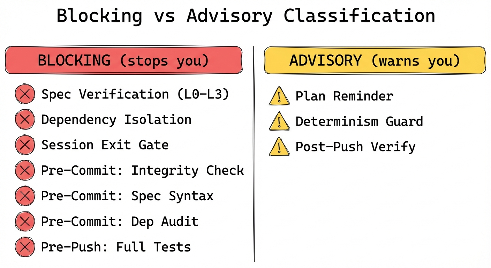
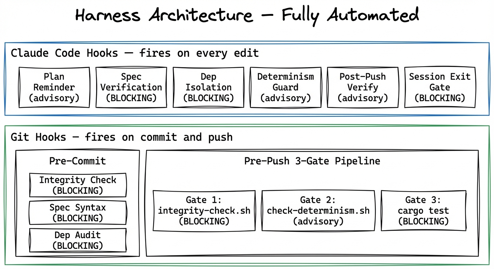
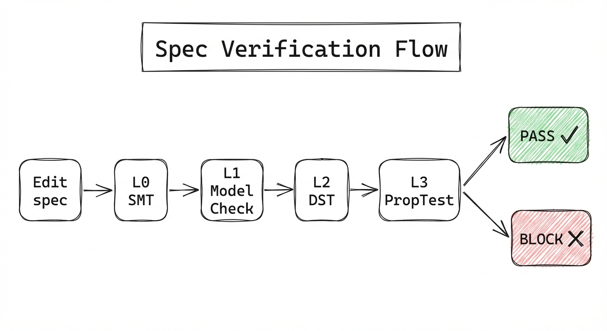
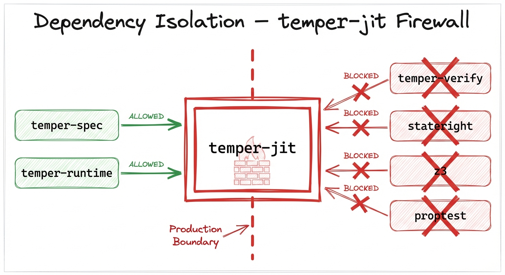
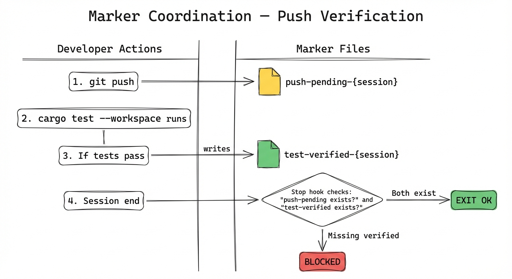
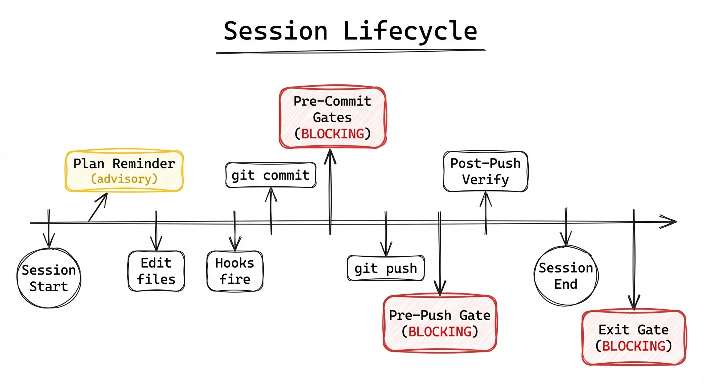

# Temper Development Harness

The Temper harness is a multi-layered enforcement system that catches problems at every stage of the development workflow — from editing to committing to pushing to session exit.

**Key difference from typical CI-only approaches**: Most projects run checks in CI, after the code is already pushed. Temper's harness enforces locally and immediately, preventing broken code from ever entering the commit history.

## Two Enforcement Contexts

This harness enforces quality for **agents developing Temper itself** (the framework). For **agents building apps WITH Temper**, enforcement happens differently:

- `temper serve --specs-dir specs/` runs the full verification cascade at startup and rejects broken specs
- The Temper skill file (`.claude/skills/temper.md`) guides agents to run `temper verify` after writing specs
- Temper itself IS the enforcement layer for apps — no separate harness needed

---

## Blocking vs Advisory Classification



Every harness component is either **blocking** (stops you, must be resolved) or **advisory** (warns you, developer decides).

### Blocking Components

| # | Component | Layer | Trigger | What it enforces |
|---|-----------|-------|---------|------------------|
| 2 | Spec Verification | Claude Code | PostToolUse (Write/Edit) | L0-L3 cascade on every spec edit |
| 3 | Dependency Isolation | Claude Code | PostToolUse (Write/Edit) | temper-jit free of verify deps |
| 6 | Session Exit Gate | Claude Code | Stop (session end) | No unverified pushes, no compile errors |
| 7 | Integrity Check | Git | pre-commit | No TODO/unwrap/unimplemented in prod code |
| 8 | Spec Syntax | Git | pre-commit | .ioa.toml files parse correctly |
| 9 | Dep Audit | Git | pre-commit | Catches dep violations on direct commits |
| 10 | Full Test Suite | Git | pre-push | All tests pass before push |

### Advisory Components

| # | Component | Layer | Trigger | What it warns about |
|---|-----------|-------|---------|---------------------|
| 1 | Plan Reminder | Claude Code | PreToolUse (Write/Edit) | No plan file found, or plan not finished |
| 4 | Determinism Guard | Claude Code | PostToolUse (Write/Edit) | HashMap/SystemTime in simulation code |
| 5 | Post-Push Verify | Claude Code | PostToolUse (Bash) | Shows test results after push (coordinates with Item 6) |

---

## Architecture Overview



The harness has three tiers, each catching problems at a different stage:

### Tier 1: Claude Code Hooks (Design-Time)
Fire automatically during Claude Code sessions. Configured in `.claude/settings.json`.

### Tier 2: Git Hooks (Commit-Time)
Fire during `git commit` and `git push`. Installed via `scripts/setup-hooks.sh`. Affect anyone using git on this repo.

### Tier 2b: Pre-Push Pipeline
The pre-push hook runs a 3-gate pipeline: integrity check, determinism audit, then full test suite. The full-codebase scripts are wired in automatically — nothing to run manually.

---

## Tier 1: Claude Code Hooks

### Item 1: Plan Reminder (PreToolUse — Write|Edit)

**File**: `.claude/hooks/check-plan-reminder.sh`
**Blocking**: No

Before any file edit, checks if a `.progress/` plan exists. Displays a reminder to create one if missing. Planning discipline comes from CLAUDE.md instructions, not hard enforcement.

### Item 2: Spec Verification Gate (PostToolUse — Write|Edit)

**File**: `.claude/hooks/verify-specs.sh`
**Blocking**: YES (exit 2)



After editing any `.ioa.toml`, `.csdl.xml`, or `.cedar` file, runs the full `temper verify` cascade:

- **L0 SMT**: Guard satisfiability via Z3 — checks for dead guards and unreachable states
- **L1 Model Check**: Stateright exhaustive state exploration — verifies all invariants are inductive
- **L2 DST**: Deterministic simulation with fault injection — proves correctness under failures
- **L3 PropTest**: 1000 random action sequences and boundary values

If any level fails, the edit is blocked. This is Temper's core value proposition.

### Item 3: Dependency Isolation Guard (PostToolUse — Write|Edit)

**File**: `.claude/hooks/check-deps.sh`
**Blocking**: YES (exit 2)



After editing any `Cargo.toml`, checks that:
1. `temper-jit` does not have `temper-verify` in production `[dependencies]`
2. No production crate (`temper-jit`, `temper-server`, `temper-runtime`) pulls in `stateright` or `proptest`

Uses `cargo tree --no-dev` to check the real dependency graph. If temper-jit depends on temper-verify, every production binary includes Z3, Stateright, and proptest (~50MB of unnecessary deps).

### Item 4: Determinism Guard (PostToolUse — Write|Edit)

**File**: `.claude/hooks/check-determinism.sh`
**Blocking**: No (advisory)

After editing `.rs` files in simulation-visible crates (`temper-runtime`, `temper-jit`, `temper-server`), scans for non-deterministic patterns:

| Pattern | Replacement | Why |
|---------|-------------|-----|
| `HashMap` | `BTreeMap` | Deterministic iteration order |
| `SystemTime::now()` | `sim_now()` | Simulation-safe time |
| `Uuid::new_v4()` | `sim_uuid()` | Deterministic UUIDs |
| `thread_rng()` | Seeded RNG | Reproducible randomness |

Add `// determinism-ok` comment to suppress false positives for legitimate uses.

### Item 5: Post-Push Verification (PostToolUse — Bash)

**File**: `.claude/hooks/post-push-verify.sh`
**Blocking**: No (but coordinates with Item 6)



After any `git push`:
1. Writes marker: `/tmp/temper-harness/{project_hash}/push-pending-{session}`
2. Runs `cargo test --workspace`
3. If tests pass: writes `/tmp/temper-harness/{project_hash}/test-verified-{session}`
4. If tests fail: marker remains unverified — Item 6 will block session exit

### Item 6: Session Exit Gate (Stop)

**File**: `.claude/hooks/stop-verify.sh`
**Blocking**: YES (exit 2)

Before Claude Code session ends, checks:
1. If a `push-pending` marker exists, a `test-verified` marker must also exist
2. `cargo check --workspace` compiles clean

This is the last line of defense — you cannot end a session with unverified pushes or compilation errors.

---

## Tier 2: Git Hooks

Install with: `scripts/setup-hooks.sh`

### Item 7: Pre-Commit — Integrity Check

**File**: `.claude/hooks/pre-commit.sh` (installed to `.git/hooks/pre-commit`)
**Blocking**: YES

Scans staged `.rs` files (excluding tests) for:
- `TODO`, `FIXME`, `XXX`, `HACK` comments
- `unimplemented!()` / `todo!()` macros
- `panic!("not implemented")`
- `.unwrap()` calls

### Item 8: Pre-Commit — Spec Syntax Validation

**Blocking**: YES (part of pre-commit hook)

If any staged file is `*.ioa.toml`, runs `temper verify` to check syntax. This catches spec errors from edits made outside Claude Code.

### Item 9: Pre-Commit — Dependency Audit

**Blocking**: YES (part of pre-commit hook)

If any `Cargo.toml` was staged, runs `scripts/audit-deps.sh`. Same check as Item 3, but catches direct git commits that bypass Claude Code hooks.

### Item 10: Pre-Push — Full Verification Pipeline

**File**: `.claude/hooks/pre-push.sh` (installed to `.git/hooks/pre-push`)
**Blocking**: YES

Runs a 3-gate pipeline before every push. All gates are automatic — nothing to run manually.

| Gate | Script | Blocking | What it checks |
|------|--------|----------|----------------|
| 1/3 | `scripts/integrity-check.sh` | YES | No TODO/unwrap/hacks in entire codebase |
| 2/3 | `scripts/check-determinism.sh` | No (advisory) | HashMap/SystemTime in simulation code |
| 3/3 | `cargo test --workspace` | YES | All tests pass |

Bypass with `git push --no-verify` for emergencies only.

---

## Session Lifecycle



A typical development session flows through all enforcement layers:

1. **Session Start** — Plan reminder fires on first edit
2. **Editing** — Spec verification, dep isolation, and determinism guards fire on each save
3. **Committing** — Pre-commit hook runs integrity check, spec syntax, and dep audit
4. **Pushing** — Pre-push runs 3-gate pipeline (integrity, determinism, tests); post-push creates verification markers
5. **Session End** — Exit gate checks markers and compilation status

---

## Setup

```bash
# Install git hooks (one-time)
scripts/setup-hooks.sh

# Claude Code hooks are configured automatically via .claude/settings.json
```

## Bypassing (Emergencies Only)

```bash
# Skip pre-commit checks
git commit --no-verify

# Skip pre-push test suite
git push --no-verify
```

Claude Code hooks cannot be bypassed — they're enforced by the tool itself. If a blocking hook fires, you must fix the issue.
